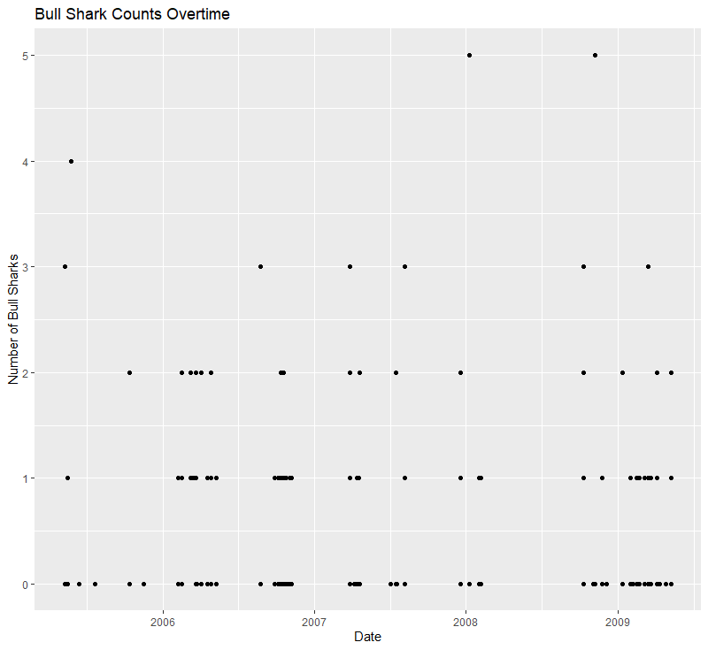
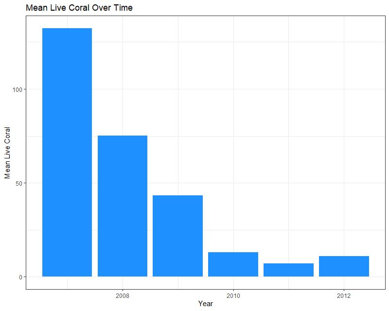
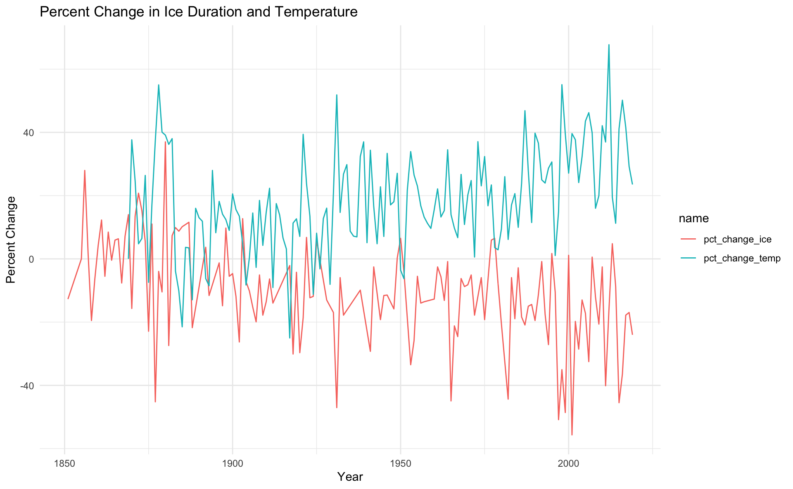

## Update 2
February 28, 2021

### Long Term Ecological Research (LTER) Datasets: R package
**Project Sponsor: National Center for Ecological Analysis and Synthesis (NCEAS)** \
**Team Members: Sam Guo, Adhitya Logan, Lia Ran, Sophia Sternberg, Karen Zhao**

#### Progress
- Began coworking hours on Fridays in addition to our weekly meeting on Mondays to collaborate, share ideas and troubleshoot.
- Learned the workflow of creating an R package from scratch based on this [example](https://github.com/isteves/r-pkg-intro ), such as creating documentation, licenses, github repositories, and functions using the say_aloha, devtools, and use_this packages.
- Created three of our own demo datasets, two where the data was provided for us, and one where we chose our own dataset from any LTER site. 
- Incorporated what we learned in past weeks, such as the github, tidyverse, and metajam workflows.
- Large importance placed on the creation of vignettes and their audiences.
- Presenting our demo packages and vignettes during our weekly meetings to update the group and to receive feedback. 
- Our installable R packages can be found here:
    - Adhitya: [Adhitya's Package](https://github.com/adhil0/alohaal)
    - Sophia: [Sophia’s Package](https://github.com/sophiasternberg/fcess)
    - Karen: [Karen’s Package](https://github.com/karenezhao/alohakez)
    - Lia: [Lia’s Package](https://github.com/liaaaaran/mcrcoral)
    - Sam: [Bonanza](https://github.com/TokyoExpress/bonanza)

###### Examples of our vignettes:

**Sophia** \
This image shows an initial view of the Bull Shark Count Overtime. This data is from the Florida Coastal Everglades (FCE) LTER Site. I thought this was an interesting plot to include because of the pattern happening YoY. 

The second image shows the relationship between Temperature and Bull Sharks. I thought this was important to include because it brings up an important point about the nature of collecting data and taking data with a grain of salt. From a first glance, it appears that more Bull Sharks are counted when the Temperature is higher; however researchers are also more likely to survey when the Temperature is warmer/nicer and that may be a bias in the data and affect the number of Bull Sharks counted.

**Lia** \
I choose a dataset from the Moorea Coral Reef site that analyzes the changes in abundance of fish functional groups in relation to live/dead coral. My initial visualization was to showcase the obvious: how live coral rates decrease over time. Then, I plotted this per site to maybe account for biases in the data that were unobserved otherwise. We concluded that coral rates continue to decrease (yet as a slower rate), despite what the initial visualization might imply. 

**Karen** \
I chose to study a dataset from the California Current Ecosystem (CCE) LTER. CCE is a coastal upwelling biome, located off the southern coast of California. Because there is a long record of observations and a rich data set from this region, many of the studies conducted here focus on changes in the ocean ecosystem. This includes a long term ocean warming trend, which can have biological effects on plankton production, fish catch and seabirds. \
The dataset that I worked with is daily sea-surface temperature measurements, collected and provided by the Shore Stations Program, La Jolla CA. The raw data contains more than 36 thousand entires. 

**Adhitya** \
This plot shows the percent change in the amount of days that lakes in Madison, WI were frozen each year, as well as the percent change in the mean annual temperature in Madison, WI. This data is from the Northern Temperate Lakes (NTL) LTER. 

It’s important for researchers to study if there are disruptions to lake ecosystems, as this can have ripple effects for the rest of the local environment. If there are disruptions, understanding the reasons behind them can help scientists mitigate these effects. To demonstrate this, data containing the length of time that Lake Monona, Lake Wingra, and Lake Mendota were frozen every year was merged with daily temperature data for Madison, WI. The lake data was averaged across all three lakes to create a single measurement for each year, and the temperature data was averaged across each year to obtain a mean annual temperature. Then, all measurements were compared with the earliest entry for both categories by computing the percent change for each year. As a result, the change in ice duration over time could be compared with the change in temperature over time on the same set of axes. 

The plot shows that, over time, the average temperature in Madison, WI is increasing and that the amount of time lakes in Madison are freezing for every year is gradually decreasing. Additionally, there are several years where a spike in temperature seems to have a corresponding decrease in ice duration. From these observations, it is possible that there is a correlation between temperature and the ice duration of lakes. In the future, time series analysis could be conducted to quantify the correlation between the two variables.

#### Future Plans
- For the remainder of this quarter, we plan to refine our packages and vignettes even more, while adding more in-depth descriptions and other important metadata about our packages. To do this, we will need to know our datasets inside and out and understand every nuance. 
- Start deciding which datasets we will import to our final product and map out a plan of how to best collaborate on this. 

